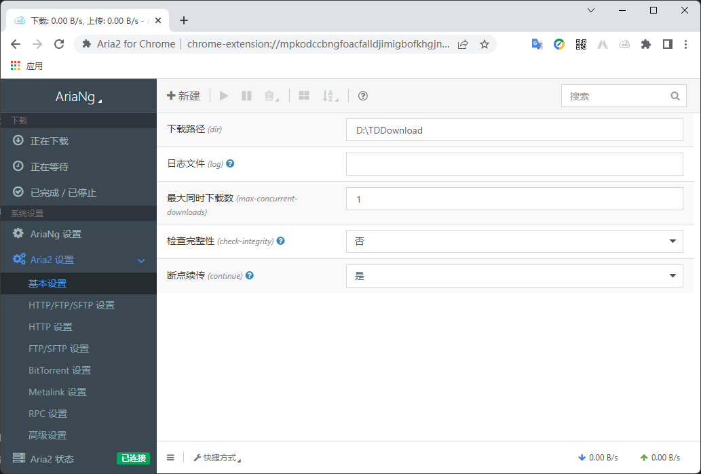

# Aria2

> *Aria2 是一款强大又轻巧的下载工具，5MB 不到的大小，支持了 HTTP、HTTPS、FTP、SFTP、BitTorrent (BT种子) 和 Metalink 等通讯协议。*

## 1 安装

&emsp;&emsp;下载 [`aria2-1.36.0-win-64bit-build1.zip`](https://github.com/aria2/aria2/releases) 并解压到目录。

## 2 配置

### 2.1 aria2.conf

|No.|Attr Key|Default Value|Suggest Value|Remark|
|:---:|:---:|:---:|:---:|-----|
|1|`dir`|<当前启动位置>||*文件的保存路径*|
|2|`disk-cache`|`16M`|`32M`|*启用磁盘缓存：0-禁用缓存*|
|3|`file-allocation`|`prealloc`||*文件预分配方式：falloc-NTFS格式，trunc-EXT3/4格式，\<注释\>-MacOS*|
|4|`continue`|`true`||*是否支持断点续传*|
|5|`max-concurrent-downloads`|`5`|`1`|*同时下载最大任务数*|
|6|`max-connection-per-server`|`1`|`5`|*同一服务器最大连接数*|
|7|`min-split-size`|`20M`|`10M`|*最小文件分片大小，取值范围：1M-1024M*|
|8|`split`|`5`||*单个任务最大线程数*|
|9|`max-overall-download-limit`|`0`||*整体下载最大限速*|
|10|`max-download-limit`|`0`||*单个任务下载最大限速*|
|11|`max-overall-upload-limit`|`0`||*整体上传最大限速*|
|12|`max-upload-limit`|`0`||*单个任务上传最大限速*|
|13|`disable-ipv6`|`false`|`true`|*是否禁用IPv6*|
|14|`input-file`|`aria2.session`||*读取下载任务文件，即会话文件*|
|15|`save-session`|`aria2.session`||*保存会话文件，保存`错误/未完成`的下载任务*|
|16|`save-session-interval`|`0`|`60`|*保存会话文件频率，单位：秒*|
|17|`enable-rpc`|`false`|`true`|*是否启用RPC*|
|18|`rpc-allow-origin-all`|`false`|`true`|*是否允许所有来源*|
|19|`rpc-listen-all`|`false`|`true`|*是否允许非外部访问*|
|20|`event-poll`|||*事件轮询方式（不同操作系统默认值不同）：epoll、kqueue、port、poll、select*|
|21|`rpc-listen-port=`|`6800`||*RPC监听端口*|
|22|`follow-torrent`|`true`|`true`|*是否自动开始BT任务*|
|23|`listen-port`|`[6881-6999]`|`51413`|*BT监听端口*|
|24|`bt-max-peers`|`55`||*单个种子最大连接数*|
|25|`enable-dht`|`true`|`false`|*是否开启DHT功能*|
|26|`enable-dht6`|`false`||*是否开启IPv6 DHT功能*|
|27|`dht-listen-port`|`6881-6999`||*DHT网络监听端口*|
|28|`bt-enable-lpd`|`false`||*启用BT节点查找（PT需要禁用）*|
|29|`enable-peer-exchange`|`true`|`false`|*是否启用种子交换（PT需要禁用）*|
|30|`bt-request-peer-speed-limit`|`50K`||*每个种子限速（对少种的PT很有用）*|
|31|`peer-id-prefix`|`-TR2770-`||*客户端伪装（PT需要）前缀*|
|32|`user-agent`|`Transmission/2.77`||*客户端伪装（PT需要）UserAgent*|
|33|`seed-ratio`|`1.0`|`0`|*当种子的分享率达到这个数时, 自动停止做种, 0为一直做种*|
|34|`force-save`|`false`||*强制保存会话*|
|35|`bt-hash-check-seed`|`true`||*是否开启BT Hash校验*|
|36|`bt-seed-unverified`|`false`|`true`|*继续之前的BT任务时, 是否无需再次校验*|
|37|`bt-save-metadata`|`false`|`true`|*是否保存磁力链接元数据为种子文件，格式：.torrent文件*|

```text
dir=D:\TDDownload
disk-cache=32M
file-allocation=falloc
continue=true
max-concurrent-downloads=1
max-connection-per-server=5
min-split-size=10M
split=5
#max-overall-download-limit=0
#max-download-limit=0
#max-overall-upload-limit=0
#max-upload-limit=0
disable-ipv6=true
input-file=aria2.session
save-session=aria2.session
save-session-interval=60
enable-rpc=true
rpc-allow-origin-all=true
rpc-listen-all=true
#event-poll=select
#rpc-listen-port=6800
#follow-torrent=true
listen-port=51413
#bt-max-peers=55
enable-dht=false
#enable-dht6=false
#dht-listen-port=6881-6999
#bt-enable-lpd=false
enable-peer-exchange=false
#bt-request-peer-speed-limit=50K
peer-id-prefix=-TR2770-
user-agent=Transmission/2.77
seed-ratio=0
#force-save=false
#bt-hash-check-seed=true
bt-seed-unverified=true
bt-save-metadata=true
```

### 2.2 aria2.session

```text
```

## 3 启动与关闭

### 3.1 startup.bat

```cmd
@echo off & title Aria2 Startup...
aria2c.exe --conf-path=aria2.conf
```

### 3.2 stop.bat

```cmd
@echo off & title Aria2 stopped.
taskkill /f /im aria2c.exe
```

### 4 Chrome 扩展程序

&emsp;&emsp;*下载 [`Aria2 for Chrome`](https://chrome.google.com/webstore/detail/aria2-for-chrome/mpkodccbngfoacfalldjimigbofkhgjn) 扩展程序。*


