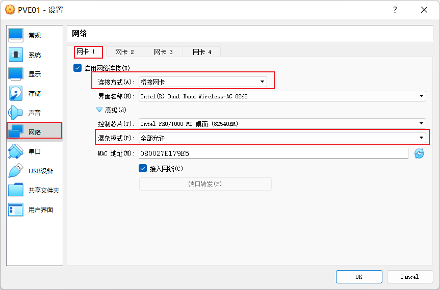

# Proxmox VE

## 1 准备

### 1.1 VirsulBox设置

&emsp;&emsp;启用 `PAE/NX` 和 `嵌套VT-x/AMD-V` 设置。其中，`嵌套VT-x/AMD-V` 需要执行以下代码：

```powershell
.\VBoxManage.exe list vms
.\VBoxManage.exe modifyvm "PVE01" --nested-hw-virt on
```


&emsp;&emsp;设置网卡连接方式为`桥接网卡`，混杂模式： `全部允许`。



### 1.2 Rufus启动盘

&emsp;&emsp;设置分区为 `MBR` 。


&emsp;&emsp;选择以 `DD` 镜像模式写入。


## 2 安装步骤

&emsp;&emsp;待完善。。。

```bash
# upgrade
apt update
apt dist-upgrade -y

# kernel
dpkg --list | grep kernel
apt purge pve-kernel-5.15.30-2-pve
reboot

# tzdata
dpkg-reconfigure tzdata
```

## 3 附录

### 3.1 管理平台：无法访问

```bash
# version
cat /etc/debian_version

# https://ip:8006
lsof -i:8006
systemctl status pveproxy
systemctl status pvedaemon
systemctl status pvestatd

# restart
systemctl restart pveproxy
systemctl restart pvedaemon
systemctl restart pvestatd
```

### 3.2 提示：无效订阅

```bash
# backup
cp /usr/share/javascript/proxmox-widget-toolkit/{proxmoxlib.js,proxmoxlib.js.bak220721}

# modify
vi /usr/share/javascript/proxmox-widget-toolkit/proxmoxlib.js
'''
                    if (res === null || res === undefined || !res || res
                        .data.status.toLowerCase() !== 'active') {
                        /*Ext.Msg.show({
                            title: gettext('No valid subscription'),
                            icon: Ext.Msg.WARNING,
                            message: Proxmox.Utils.getNoSubKeyHtml(res.data.url),
                            buttons: Ext.Msg.OK,
                            callback: function(btn) {
                                if (btn !== 'ok') {
                                    return;
                                }
                                orig_cmd();
                            },
                        });*/
'''

# retart
systemctl restart pveproxy
```

### 3.3 切换PVE的Debian源

```bash
# backup
cp /etc/apt/{sources.list,sources.list.bak220721}

# aliyun
cat > /etc/apt/sources.list <<-'EOF'
deb http://mirrors.aliyun.com/debian/ bullseye main non-free contrib
# deb-src http://mirrors.aliyun.com/debian/ bullseye main non-free contrib
deb http://mirrors.aliyun.com/debian-security/ bullseye-security main
# deb-src http://mirrors.aliyun.com/debian-security/ bullseye-security main
deb http://mirrors.aliyun.com/debian/ bullseye-updates main non-free contrib
# deb-src http://mirrors.aliyun.com/debian/ bullseye-updates main non-free contrib
deb http://mirrors.aliyun.com/debian/ bullseye-backports main non-free contrib
# deb-src http://mirrors.aliyun.com/debian/ bullseye-backports main non-free contrib
EOF

# ustc
cat > /etc/apt/sources.list <<-'EOF'
deb https://mirrors.ustc.edu.cn/debian/ bullseye main contrib non-free
# deb-src https://mirrors.ustc.edu.cn/debian/ bullseye main contrib non-free
deb https://mirrors.ustc.edu.cn/debian/ bullseye-updates main contrib non-free
# deb-src https://mirrors.ustc.edu.cn/debian/ bullseye-updates main contrib non-free
deb https://mirrors.ustc.edu.cn/debian/ bullseye-backports main contrib non-free
# deb-src https://mirrors.ustc.edu.cn/debian/ bullseye-backports main contrib non-free
deb https://mirrors.ustc.edu.cn/debian-security/ bullseye-security main contrib non-free
# deb-src https://mirrors.ustc.edu.cn/debian-security/ bullseye-security main contrib non-free
EOF

# tsinghua √
cat > /etc/apt/sources.list <<-'EOF'
deb https://mirrors.tuna.tsinghua.edu.cn/debian/ bullseye main contrib non-free
# deb-src https://mirrors.tuna.tsinghua.edu.cn/debian/ bullseye main contrib non-free
deb https://mirrors.tuna.tsinghua.edu.cn/debian/ bullseye-updates main contrib non-free
# deb-src https://mirrors.tuna.tsinghua.edu.cn/debian/ bullseye-updates main contrib non-free
deb https://mirrors.tuna.tsinghua.edu.cn/debian-security bullseye-security main contrib non-free
# deb-src https://mirrors.tuna.tsinghua.edu.cn/debian-security bullseye-security main contrib non-free
deb https://mirrors.tuna.tsinghua.edu.cn/debian/ bullseye-backports main contrib non-free
# deb-src https://mirrors.tuna.tsinghua.edu.cn/debian/ bullseye-backports main contrib non-free
EOF

apt update
```

### 3.4 切换PVE的企业源

```bash
cat > /etc/apt/sources.list.d/pve-enterprise.list <<-'EOF'
#deb https://enterprise.proxmox.com/debian/pve bullseye pve-enterprise
EOF

# ustc
cat > /etc/apt/sources.list.d/pve-no-subscription.list <<-'EOF'
deb https://mirrors.ustc.edu.cn/proxmox/debian/pve bullseye pve-no-subscription
EOF

# tsinghua √
cat > /etc/apt/sources.list.d/pve-no-subscription.list <<-'EOF'
deb https://mirrors.tuna.tsinghua.edu.cn/proxmox/debian bullseye pve-no-subscription
EOF

apt update

apt install ifupdown2
```

### 3.5 切换PVE的CT Templates源

```bash
# backup
cp /usr/share/perl5/PVE/{APLInfo.pm,APLInfo.pm.bak220721}

# ustc
sed -i 's|http://download.proxmox.com|https://mirrors.ustc.edu.cn/proxmox|g' \
  /usr/share/perl5/PVE/APLInfo.pm

# tsinghua √
sed -i 's|http://download.proxmox.com|https://mirrors.tuna.tsinghua.edu.cn/proxmox|g' \
  /usr/share/perl5/PVE/APLInfo.pm

reboot
```

### 3.6 修改PVE环境IP地址

```bash
# ipv4
vi /etc/network/interfaces
'''
iface vmbr0 inet static
        address 192.168.1.70/24
        gateway 192.168.1.1
'''

# dns
vi /etc/resolv.conf
'''
nameserver 192.168.1.1
'''

# hosts
vi /etc/hosts
'''
192.168.1.70 pve.localhost pve
'''

# issue -- non-essential
vi /etc/issue
'''
  https://192.168.1.70:8006/
'''

reboot
```

### 3.7 [OpenVZ Templates download](https://download.openvz.org/template/precreated/)

> [Since Proxmox VE 7.0, the default is a pure cgroupv2 environment.](https://pve.proxmox.com/pve-docs/chapter-pct.html#pct_cgroup_compat)

```bash
# upload
# iso -> /var/lib/vz/template/iso
ls /var/lib/vz/template/cache
```
